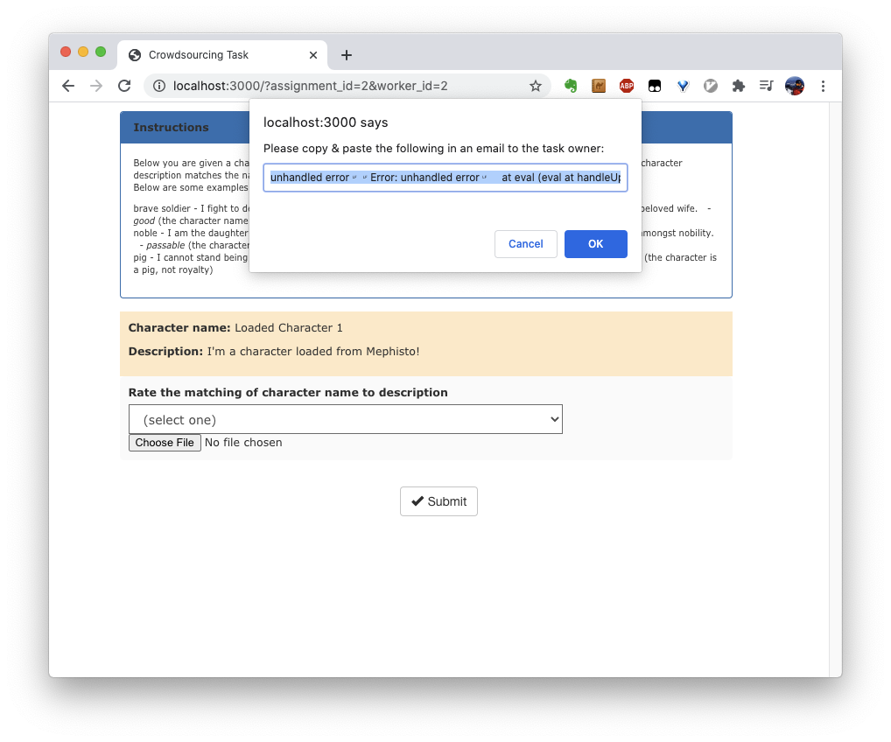

### How do I add UI error handling for my tasks?

Currently, we have beta functionality for error handling. We provide a few ways of getting a signal into how your tasks are faring:

1. Proactively alerting crowd workers when an error occurs and encouraging them to contact you if this happens
2. Auto-logging errors for React-based tasks
2. Exposing error logging infrastructure for more advanced custom front-end use cases

To opt into #1 above, you need to define a global variable as such:
```js
window._MEPHISTO_CONFIG_ = {
    /* required: */
    ADD_ERROR_HANDLING: true,
    /* optional: */
    ERROR_REPORT_TO_EMAIL: "example@example.org"
}
```

This will show a prompt as such if an uncaught error is detected:



For #2 above, auto-logging can be enabled for React apps by importing the `<ErrorBoundary />` component and wiring it up as such:

```jsx
import { ErrorBoundary } from "mephisto-task";
...
const { handleFatalError, /* ... */ } = useMephistoTask();
...
return (
  <ErrorBoundary handleError={handleFatalError}>
    <MyApp />
  </ErrorBoundary>
);
```

This will automatically send an error packet to the backend Mephisto server when an error occurs.

`handleFatalError` can also be used in any custom logic code you wish - for example, in handling errors for AJAX requests which live outside of the scope of React Error Boundaries:

```jsx
fetch("example.org/api/endpoint")
    .catch(err => handleFatalError(err.toString()));
```