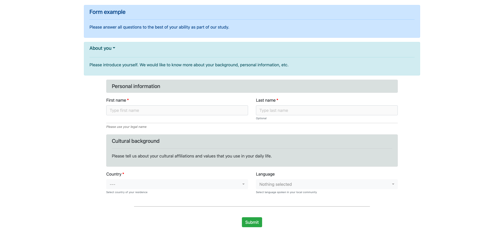
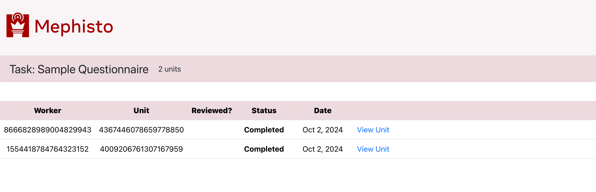
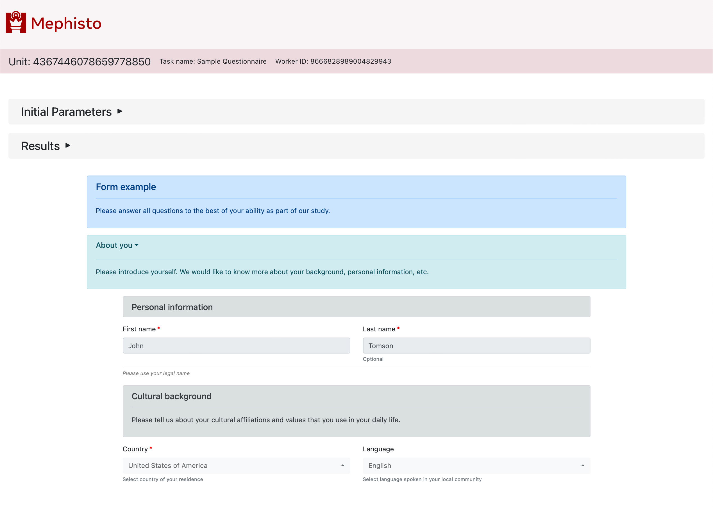

---
# Copyright (c) Meta Platforms and its affiliates.
# This source code is licensed under the MIT license found in the
# LICENSE file in the root directory of this source tree.

sidebar_position: 1
---

# FormComposer overview

You can easily generate form-based Tasks using our FormComposer task generator feature. It produces clean cross-platform Bootstrap forms with client-side form validation.

## Live demo

You can find working demos of FormComposer in `examples/form_composer_demo` repo directory.

For details on how to run these examples, refer to the demo's [README.md](https://github.com/facebookresearch/Mephisto/blob/main/examples/form_composer_demo/README.md)

## FormComposer app UI

The below screenshots showcase FormComposer app UI.

### Worker view - initial form

 
 

### Worker view - completed form

 
 

### Researcher view - Task Review main page

 
 

### Researcher view - Task Review units list

 
 

### Researcher view - Task Review unit page

 
 
