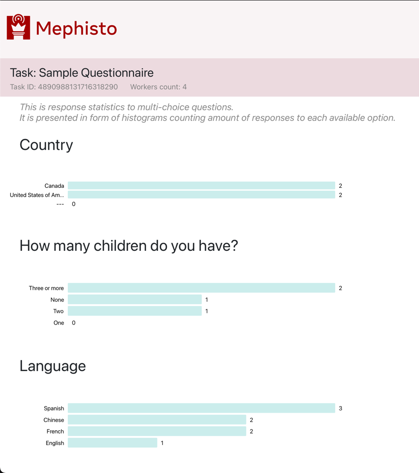

---
# Copyright (c) Meta Platforms and its affiliates.
# This source code is licensed under the MIT license found in the
# LICENSE file in the root directory of this source tree.

sidebar_position: 4
---

# Enable Responses Histogram

Some tasks can display simple histograms with response frequencies.
To enable response frequency histograms, add a tag `form-composer` in the Task's YAML config under `mephisto.task.task_tags` section.

**Note** that currently this feature is supported only by FormComposer-based Tasks.

Example YAML config:

```yaml
mephisto:
  ...
  task:
    task_name: "My form-based task"
    ...
    task_tags: "my-tag-1,my-tag-2,form-composer"
```

This is how histograms typically look like:


