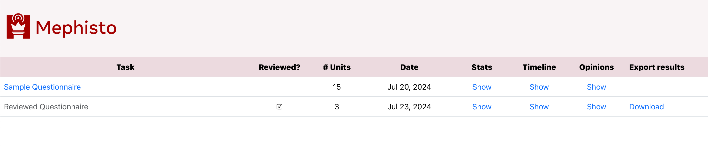
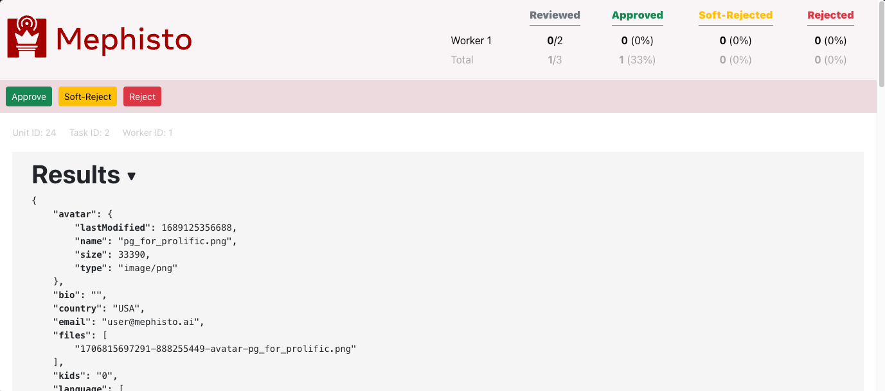
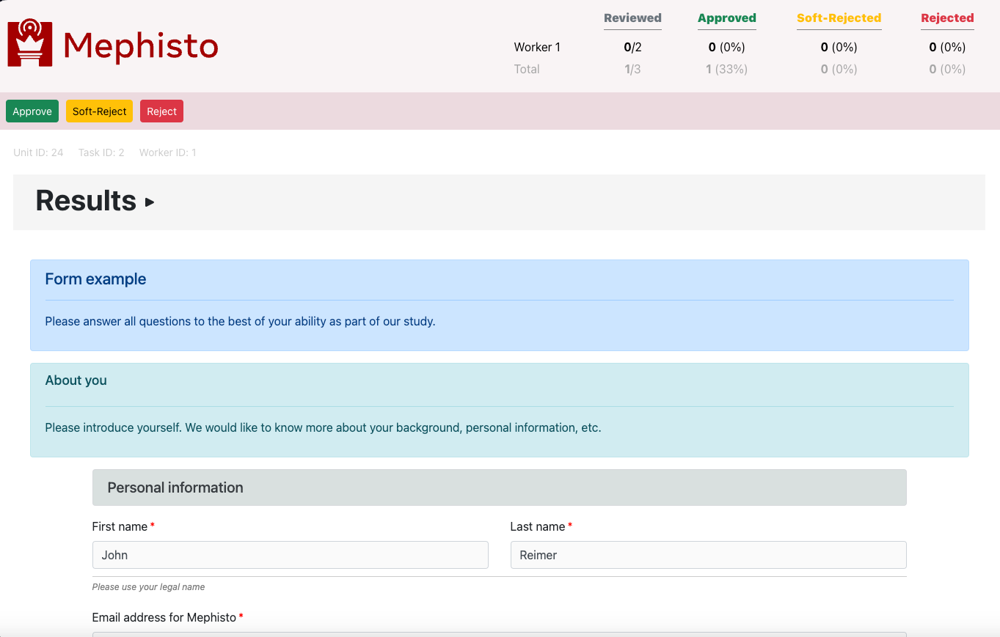
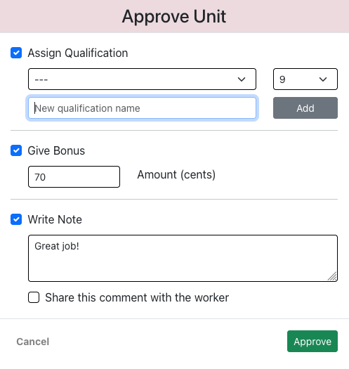

---
# Copyright (c) Meta Platforms and its affiliates.
# This source code is licensed under the MIT license found in the
# LICENSE file in the root directory of this source tree.

sidebar_position: 1
---

# Overview

To quickly and conveniently review results of a finished TaskRun, Mephisto provides a browser-based TaskReview app.

## Functionality

TaskReview app enables you to:
- View inputs submitted by each worker (using a custom view layout if desired)
- Accept, Soft-reject or Reject worker results
- Assign and update worker qualifications, based on their submitted work
- Send bonuses and feedback to worker, and record your own notes
- Download all Task results conveniently assembled into one JSON file

## User interface

Here is how TaskReview app UI looks like.

_Note that a custom view of Task results is included (at the bottom) only if you specified a custom "review" version of your Task's UI._

### List of tasks

 
 

### Generic Task results view

 
 

### Custom Task results view

 
 

### Submission approval dialog

 
 

### Submission reject dialog

 
 
