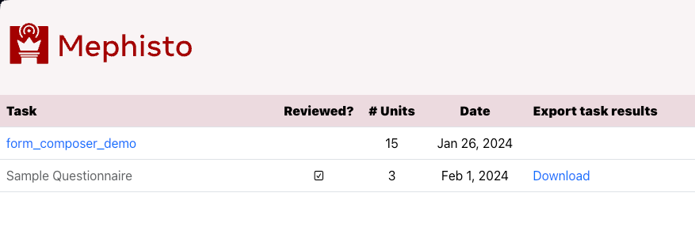
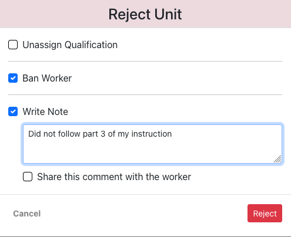
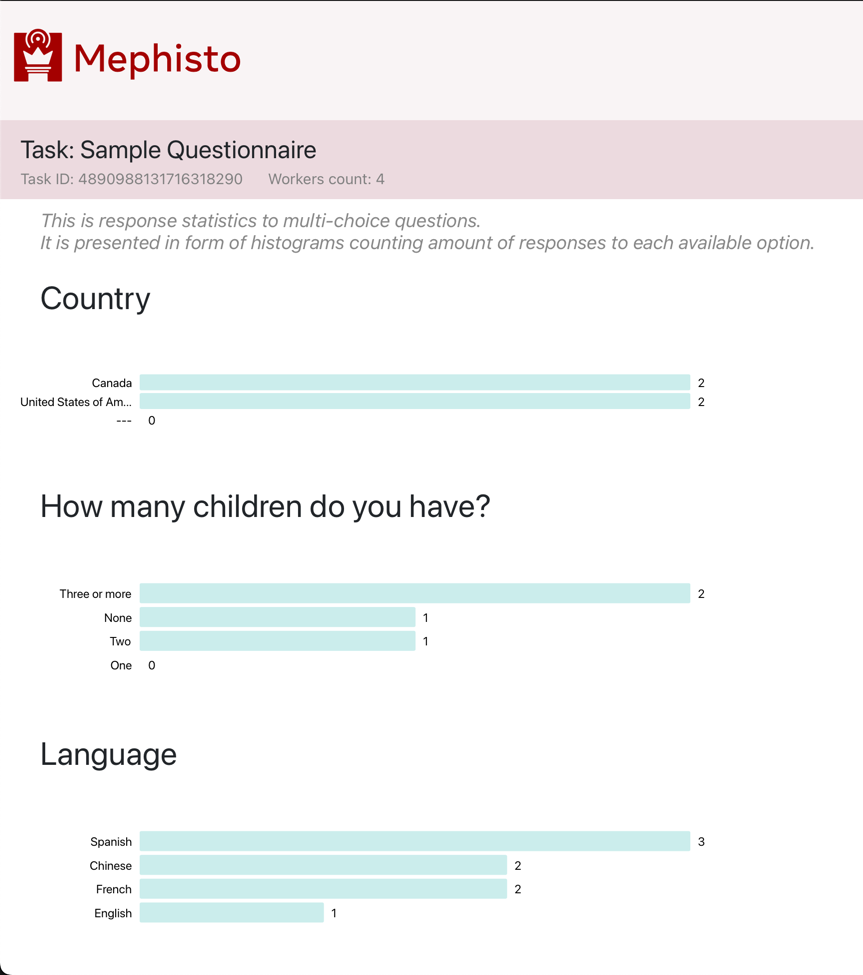

---
# Copyright (c) Meta Platforms and its affiliates.
# This source code is licensed under the MIT license found in the
# LICENSE file in the root directory of this source tree.

sidebar_position: 1
---

# Overview

Generally, to view/export the data, you could write a Python script using the Mephisto [`DataBrowser` class](https://github.com/facebookresearch/Mephisto/blob/main/mephisto/tools/data_browser.py) to access the submitted data.

For example, for the `html-static-task-example` task such a script already exists in the task folder, called [`examine_results.py`](https://github.com/facebookresearch/Mephisto/blob/main/examples/simple_static_task/examine_results.py). (This file uses the Mephisto `DataBrowser` class through the helpers in `mephisto.tools.examine_utils`.)

Another example is TaskReview app, an application with convenient rich UI.

## TaskReview app

To quickly and conveniently review results of a finished TaskRun, Mephisto provides a browser-based TaskReview app.

### TaskReview app functionality

TaskReview app enables you to:
- View inputs submitted by each worker (using a custom view layout if desired)
- Accept, Soft-reject or Reject worker results
- Assign and update worker qualifications, based on their submitted work
- Send bonuses and feedback to worker, and record your own notes
- Download all Task results conveniently assembled into one JSON file

### TaskReview app UI

Here is how TaskReview app UI looks like.

_Note that a custom view of Task results is included (at the bottom) only if you specified a custom "review" version of your Task's UI._

### List of tasks

 
 

### Generic Task results view

 
 

### Custom Task results view

 
 

### Submission approval dialog

 
 

### Submission reject dialog

 
 

### Task statistics

 
 

### Task worker opinions

 
 
