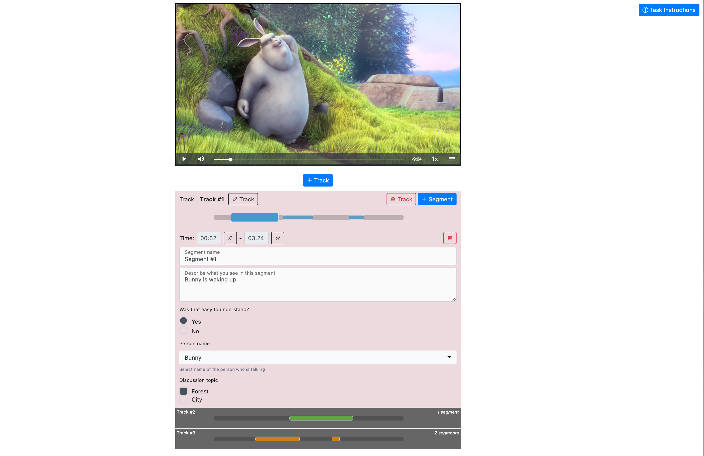

---
# Copyright (c) Meta Platforms and its affiliates.
# This source code is licensed under the MIT license found in the
# LICENSE file in the root directory of this source tree.

sidebar_position: 1
---

# VideoAnnotator overview

You can easily generate tasks to annotate any preuploaded video with our VideoAnnotator feature. 
It produces UI with video and instructions, where workers can create tracks with segments which they need to annotate. 

## Live demo

You can find working demos of VideoAnnotator in `examples/video_annotator_demo` repo directory.

For details on how to run these examples, refer to the demo's [README.md](https://github.com/facebookresearch/Mephisto/blob/main/examples/video_annotator_demo/README.md)

### VideoAnnotator app UI

Here is how VideoAnnotator app UI looks like.

### Just started task

 
 

### Annotated video

 
 

