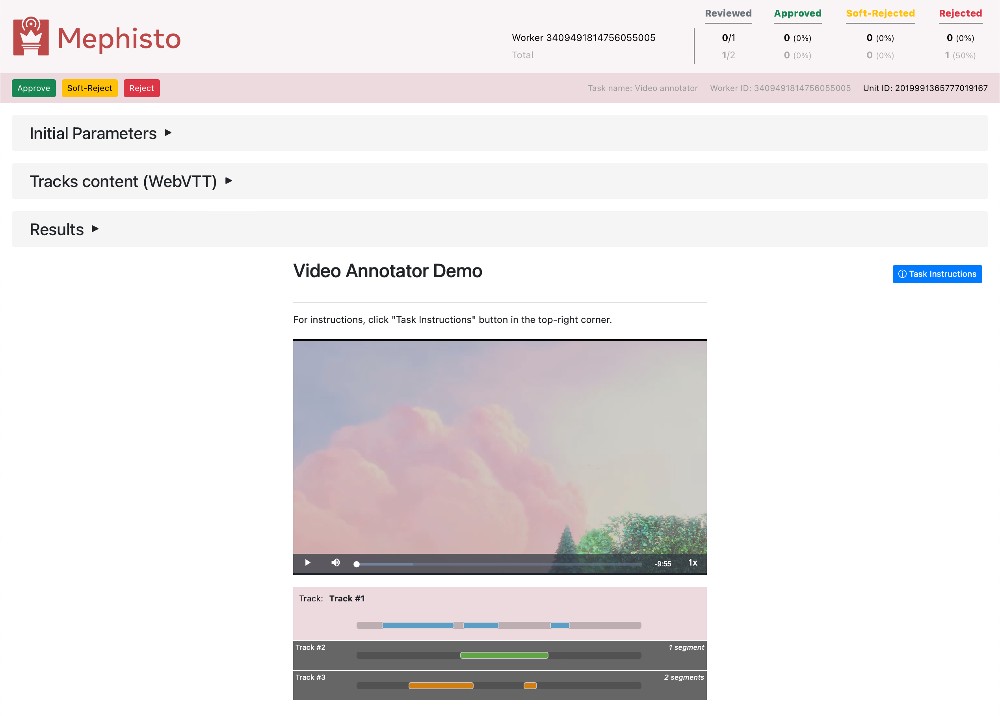
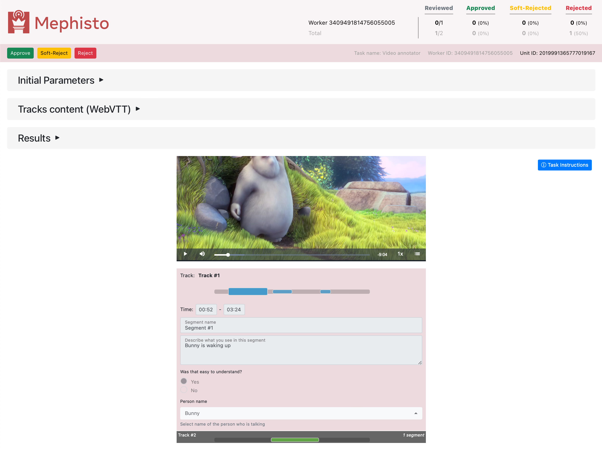
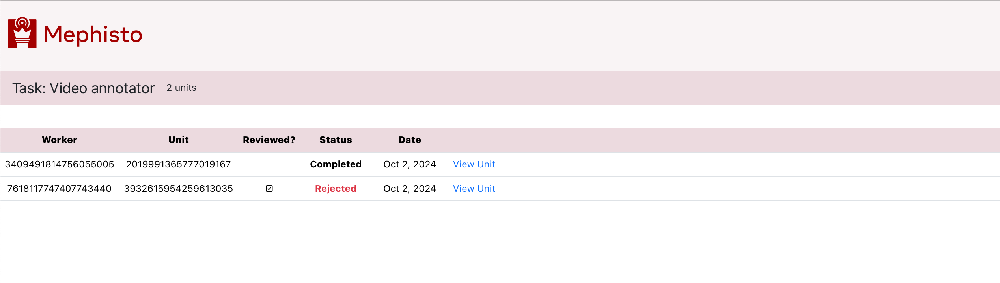
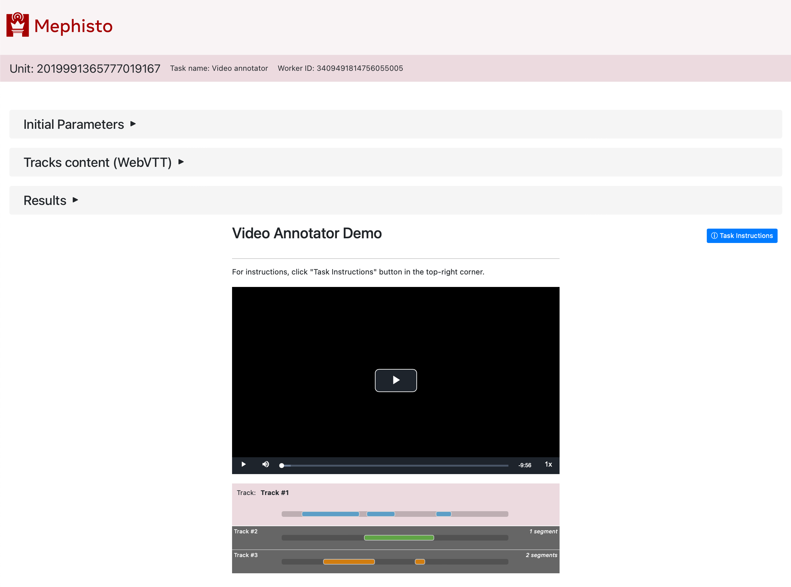

---
# Copyright (c) Meta Platforms and its affiliates.
# This source code is licensed under the MIT license found in the
# LICENSE file in the root directory of this source tree.

sidebar_position: 1
---

# VideoAnnotator overview

You can easily generate tasks to annotate any preuploaded video with our VideoAnnotator feature.
It produces UI with video and instructions, where workers can create tracks with segments which they need to annotate.

## Live demo

You can find working demos of VideoAnnotator in `examples/video_annotator_demo` repo directory.

For details on how to run these examples, refer to the demo's [README.md](https://github.com/facebookresearch/Mephisto/blob/main/examples/video_annotator_demo/README.md)

## VideoAnnotator app UI

The below screenshots showcase VideoAnnotator app UI.

### Worker view - initial annotator

 
 

### Worker view - completed annotations

 
 

### Researcher view - Task Review unit page - collapsed sections

 
 

### Researcher view - Task Review unit page - segment section

 
 

### Researcher view - Task Review unit page - WebVTT section

 
 

### Researcher view - Task Review units list

 
 

### Researcher view - Task Review unit page

 
 
