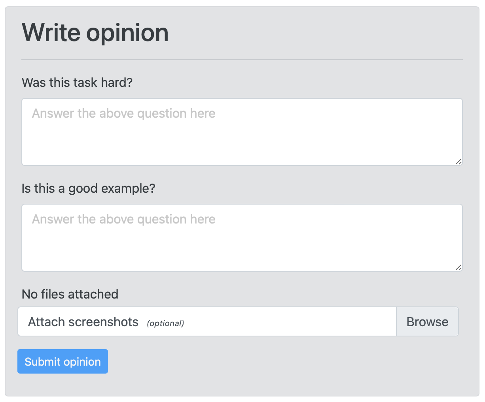

---

# Copyright (c) Meta Platforms and its affiliates.
# This source code is licensed under the MIT license found in the
# LICENSE file in the root directory of this source tree.

sidebar_position: 2
---

# WorkerOpinion widget

Workers can leave their feedback about a Task if you add a `WorkerOpinion` feature to it.

WorkerOpinion widget currently may contain a set of textarea form fields, and a multi-file attachment form field.


## How to enable `WorkerOpinion`

1. Add `mephisto-addons` library to your webpack config
2. Import `WorkerOpinion` component to your Task's React application code and define questions.

### 1. Webpack config

```js
// Specifies location of your packages (e.g. `../../dir`)
var PATH_TO_PACKAGES = "<path>"

module.exports = {
  ...
  resolve: {
    alias: {
      ...
      "mephisto-addons": path.resolve(
        __dirname,
        `${PATH_TO_PACKAGES}/packages/mephisto-addons`
      ),
    }
  }
};
```

### 2. `WorkerOpinion` component

```jsx
import { WorkerOpinion } from "mephisto-addons";
...
return(
  <div ...>
    <WorkerOpinion
      maxTextLength={500}
      questions={[
        "Was this task hard?",
        "Is this a good example?",
      ]}
    />
  </div>
)
```

Supported properties for `WorkerOpinion` component:

- `handleSubmit` (optional) - your custom callback that will run on opinion submit
- `maxTextLength` (optional) - max amount of characters for all textarea fields
- `questions` (optional, array of strings) - list of questions for the worker, where each response is a textarea field
- `required` (optional) - if `false`, adds `" (optional)"` suffix to question text (default: `false`)
- `textAreaWidth` (optional) - width of all textarea fields (default: `100%`)
- `title` (optional) - title of the WorkerOpinion widget. Default: `Your Feedback`

Here's how `WorkerOpinion` component looks like:




## How `WorkerOpinion` works

1. After completing each unit, workers can submit an opinion about the completed unit.
2. **Once the task is shut down**, you can review all collected opinions for the task in TaskReview app.
3. When reviewing units in TaskReview app, you will see an extra accordion section "Worker Opinion" if a worker submitted their opinion.
