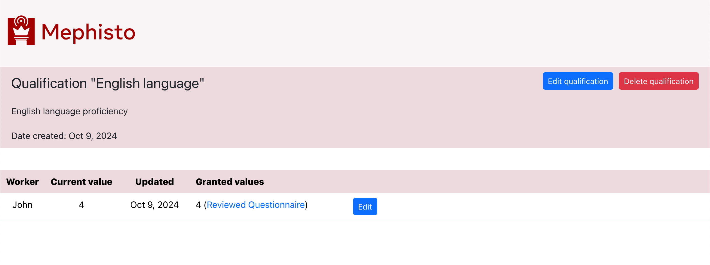

---

# Copyright (c) Meta Platforms and its affiliates.
# This source code is licensed under the MIT license found in the
# LICENSE file in the root directory of this source tree.

sidebar_position: 2
---

# Managing worker qualifications

You can easily manage qualification via [TaskReview app](/docs/guides/how_to_use/review_app/overview/) UI.
[This section](/docs/guides/how_to_use/review_app/running/) describes how to install and run it.

# Worker Qualifications

Once TaskReview app has started, on its main page you'll find a "Worker Qualifications" tab. There you can:
- view worker qualifications (i.e. qualifications assigned to your workers)
- create a new qualification
- filter and sort worker qualifications
- edit worker qualification values
- revoke worker qualification completely
- access single qualification pages
- access related task unit pages

 
 

# Qualification page

Qualification page lists all workers who possess that particular qualification. There you can:

- view and edit general info about the qualification
- delete this qualification (along with all related worker qualification records)
- edit value of each worker qualification record
- revoke this qualification from a worker completely
- access related task unit pages

 
 

# Unit page

Among other things, a (read-only) Unit page includes a list of all qualifications that were granted to a worker in the context of that particular Unit.

 
 

# Unit review page

While reviewing task units, you can:
- create a new qualification
- assign qualification to a worker (approve and soft-reject actions)
- write a note to yourself pertaining to the qualification assignment

_Note that to completely revoke a pre-existing qualification from a worker, you will nee dto navigate to that Task Unit page via "Worker Qualifications" tab of the TaskReview app._

 

 
 
