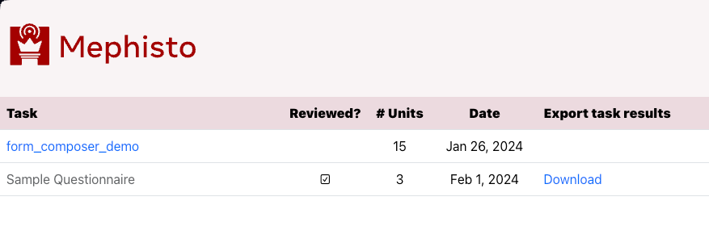
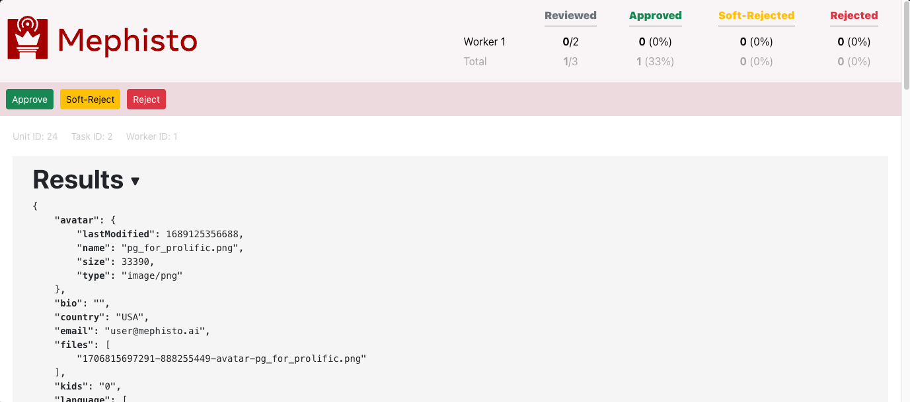
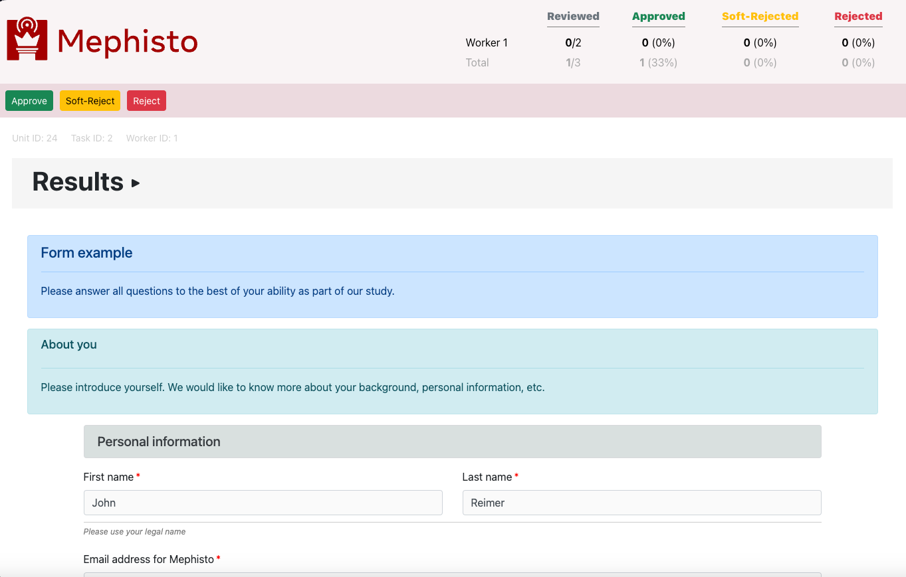
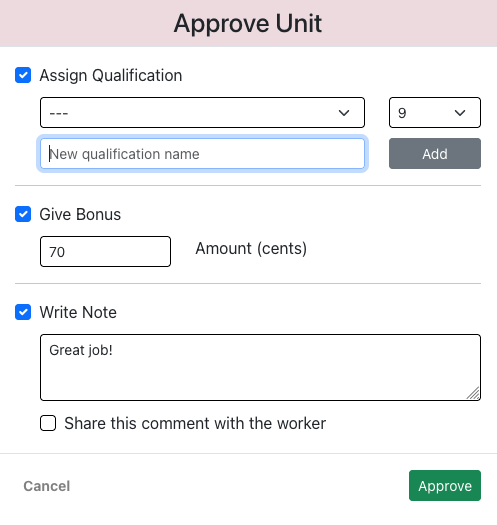
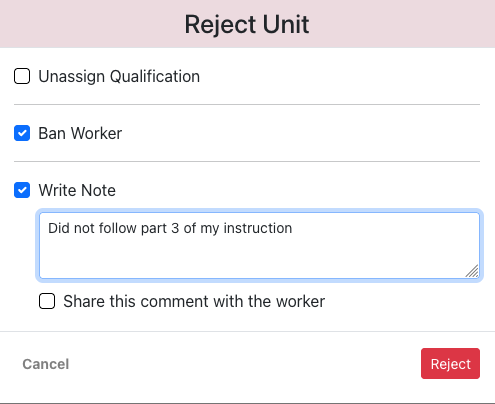

<!---
  Copyright (c) Meta Platforms and its affiliates.
  This source code is licensed under the MIT license found in the
  LICENSE file in the root directory of this source tree.
-->

## Run TaskReview app


### Quick Start

For cross-platform compatibility, TaskReview app can be run in dockerized form.

Let's say we already have local database with completed (but not reviewed) tasks, and we need to run this TaskReview app.

---

#### Single command launch

Run `docker-compose` from repo root:

```shell
docker-compose -f docker/docker-compose.dev.yml run \
    --build \
    --publish 8081:8000 \
    --rm mephisto_dc \
    mephisto review_app -h 0.0.0.0 -p 8000 -d True -f False -s False
```

where

- `--build` - builds image before starting container
- `--publish 8081:8000` - maps docker ports, with `8000` being same port as in `-p` option
- `--rm` - automatically removes the previous container if it already exits
- `mephisto_dc` - container name in `docker-compose.dev.yml` file
- `mephisto review_app -h 0.0.0.0 -p 8000 -d True` - launches Mephisto's TaskReview app service inside the container

Command `mephisto review_app` supports the following options:

- `-h/--host` - host where TaskReview app will be served
- `-p/--port` - port where TaskReview app will be served
- `-d/--debug` - run in debug mode (with extra logging)
- `-f/--force-rebuild` - force rebuild React bundle (use if your Task client code has been updated)
- `-s/--skip-build` - skip all installation and building steps for the UI, and directly launch the server (use if no code has been changed)

Now you can access TaskReview app in your browser at [http://localhost:8081](http://localhost:8081).

---

#### Multi-step launch

TaskReview app consists of server and client parts. To run them in separate steps:

1. In repo root, launch containers: `docker-compose -f docker/docker-compose.dev.yml up`
2. SSH into running container to run server: `docker exec -it mephisto_dc bash`
3. Inside the container run server: `cd /mephisto && mephisto review_app -h 0.0.0.0 -p 8000 -d True -s True`
4. SSH into running container to run client: `docker exec -it mephisto_dc bash`
5. Inside the container run client: `cd /mephisto/mephisto/review_app/client/ && REACT_APP__API_URL=http://localhost:8081 PORT=3000 npm start`
6. Open TaskReview app in your browser at (http://localhost:3001)](http://localhost:3001).

---

## Prepare your Task app

For compatibility with TaskReview app, you will need to create a separate "review" version of your app.
_The "review" version will be shown to reviewer inside an iframe, while "regular" version will be shown to crowd worker._

1. Create `review_app` subdirectory of your app, next to the main `app` subdirectory. Its content should include:
    - Main JS file `review.js` for ReviewApp
        - Example: [review.js](/examples/remote_procedure/mnist/webapp/src/review.js)
    - ReviewApp `reviewapp.jsx`
        - Example: [reviewapp.jsx](/examples/remote_procedure/mnist/webapp/src/reviewapp.jsx)
    - Separate Webpack config `webpack.config.review.js`
        - Example: [webpack.config.review.js](/examples/remote_procedure/mnist/webapp/webpack.config.review.js)

2. Specify in your Hydra YAML, under mephisto.blueprint section:
```json
task_source_review: ${task_dir}/webapp/build/bundle.review.js
```

3. Add a separate build command for the "review" bundle
```json
"build:review": "webpack --config=webpack.config.review.js --mode development"
```
Example: [package.json](/examples/remote_procedure/mnist/webapp/package.json)

4. Build this "review" bundle by running `npm run build:review` from directory with `package.json`.

5. This `reviewapp.jsx` must satisfy 3 requirements, to interface with TaskReview:
    - Render "review" task version only upon receiving messages with Task data:
        - Example: comment #1 in [reviewapp.jsx](/examples/remote_procedure/mnist/webapp/src/reviewapp.jsx)
    - Send messages with displayed "review" page height (to resize containing iframe and avoid scrollbars)
        - Example: comment #2 in [reviewapp.jsx](/examples/remote_procedure/mnist/webapp/src/reviewapp.jsx)
        `<div ref={appRef}>`
    - Rendered component must always return reference to `appRef`, like so `<div ref={appRef}>`
        - Example: comment #3 in [reviewapp.jsx](/examples/remote_procedure/mnist/webapp/src/reviewapp.jsx)

---

## TaskReview app UI

A quick overview of how TaskReview looks like.

_Note that Submission page will include a customized Task results view (at the bottom) only if your Task provides a custom layout for TaskReview app._






